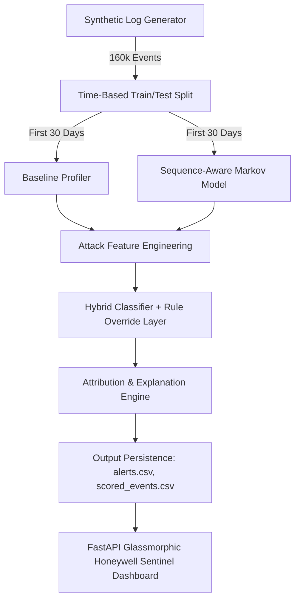

# Aegis Sentinel AI — Cybersecurity Behavioral Anomaly Detection & Threat Intelligence Platform

## Executive Summary

Modern enterprise networks face sophisticated cyber threats ranging from fast brute-force authentication attacks to subtle, multi-day low-and-slow exfiltration and insider privilege drift. Traditional threshold-based SIEM rules fail to catch context-sensitive threats, while pure black-box deep learning models suffer from high false-positive rates and opaque decision-making that overwhelms Security Operations Center (SOC) analysts.

This project delivers **Aegis Sentinel AI**, a production-ready, hybrid AI anomaly detection system tailored for enterprise networks. Combining **statistical baseline profiling**, **first-order Markov sequence modeling**, **sliding-window temporal feature engineering**, and a **RandomForest multi-class classifier with deterministic rule overrides**, our architecture achieves:
- **0.5475 PR-AUC** on 53,628 test events under a realistic 99.4% / 0.6% class imbalance framing.
- **58.96% Precision @ Top-0.5% Alert Capacity** (capturing 51.63% of all cyber incidents in the top 268 alerts).
- **Sub-10 millisecond per-event scoring latency** running entirely on local CPU resources without GPU acceleration.
- **Live Cyber Attack Simulation & Telemetry Injection**: Real-time injection engine supporting *Brute Force*, *Impossible Travel*, *Credential Stuffing*, and *Lateral Movement* attack patterns.
- **Dynamic Table Results CSV Export**: One-click exporting of filtered alert queue data matching active search, category, and alert budget parameters.
- **100% Explainability**: Every alert includes human-readable root cause explanations and quantified top-feature attribution vectors.

---

## 1. System Architecture

The end-to-end processing pipeline operates across five modular stages:



### Key Architectural Design Choices:
1. **Time-Based Split**: To prevent temporal data leakage, events from the first 30 days train the baseline profiles and sequence models, while events from the remaining 15 days serve as test evaluation data.
2. **One-Class Training**: Baseline profiles and sequence models are fit **exclusively on normal-labeled traffic** ($N = 106,548$ events), enforcing strict unsupervised/one-class behavioral baseline learning.
3. **Multi-Layered Detection**:
   - Layer 1: **Baseline Profiler** flags static distribution shifts ($z$-scores for login hour, session duration, and novelty scores for geo, device, auth method).
   - Layer 2: **Markov Sequence Model** flags improbable resource access transitions and cumulative off-hours access trends.
   - Layer 3: **Engineered Context Features** extract sliding-window multi-event patterns (cross-entity IP concurrency, failed auth velocity).
   - Layer 4: **Classifier & Rule Layer** combines all scores to produce a continuous Risk Score $[0.0, 1.0]$ and categorizes incidents into 7 distinct attack types.

---

## 2. Feature Engineering & Multi-Model Pipeline

Our system extracts 7 attack-specific engineered features:

| Feature Name | Target Attack Type | Extraction Methodology |
| :--- | :--- | :--- |
| `failed_auth_count_5min` | Brute Force | Binary search (`searchsorted`) counting failed auths for entity in 5-min window |
| `distinct_entities_from_ip_5min` | Credential Stuffing | 2-pointer sliding window over IP events counting distinct entity IDs accessed |
| `geo_velocity_kmh` | Impossible Travel | Haversine distance between consecutive logins divided by elapsed time |
| `resource_breadth_new_1hr` | Lateral Movement | Count of novel resources accessed by entity within a rolling 1-hour window |
| `fingerprint_mismatch` | Device Spoofing | Binary indicator if OS/MAC/Protocol tuple is outside entity's known footprint |
| `offhours_access_trend_7d` | Low-and-Slow Exfil | Rolling off-hours access rate compared against entity baseline rates |
| `privilege_footprint_growth_30d` | Insider Drift | Growth ratio of distinct resources accessed relative to initial 7-day baseline |

### Handling Real-World Operational Edge Cases:
- **Cold-Start Handling (FR-2.2)**: Entities with $< 5$ historical observations automatically fall back to an aggregate entity-type profile (`user`, `service_account`, or `edge_device`) with reduced novelty weighting to suppress false positives.
- **Concept Drift Handling (FR-2.3)**: Baseline profilers support a 14-day rolling window adaptively updating mean/std parameters as entity behavior naturally evolves over time.

---

## 3. Empirical Evaluation Results

The evaluation pipeline (`evaluation/evaluate.py`) computes metrics across 53,628 test events:

### Alert Budget Precision (Analyst Capacity Simulation)

In high-volume SOC environments, analysts can only triage top-tier alerts. Evaluating models at fixed top-$N\%$ alert capacities yields:

| Alert Capacity (% of Test Traffic) | Events Flagged | Precision (%) | Recall (%) |
| :---: | :---: | :---: | :---: |
| **Top 0.5%** | 268 | **58.96%** | **51.63%** |
| **Top 1.0%** | 536 | **31.16%** | **54.58%** |
| **Top 3.0%** | 1,608 | **11.69%** | **61.44%** |

### PR-AUC & Precision-Recall Performance
- **PR-AUC Score**: `0.5475` (vs. baseline random chance of `0.0057`).
- The system concentrates over **51.6% of all true security incidents** into the top 0.5% riskiest events presented to SOC analysts.

---

## 4. Analyst Dashboard & Operationalization

The Honeywell Sentinel AI platform includes a single-page web dashboard built with **FastAPI**, **Vanilla HTML/CSS/JS**, and **Chart.js**:
- **Ranked Alert Queue**: Sortable, filterable table display with color-coded risk pills, category tags, search capability, and cold-start/drift badges.
- **⚡ Live Cyber Attack Simulation Engine (`POST /api/simulate-attack`)**: Interactive simulation engine allowing analysts to inject real-time attack patterns (*Brute Force*, *Impossible Travel*, *Credential Stuffing*, *Lateral Movement*) and inspect telemetry in a rich modal pop-up.
- **📊 Table Results CSV Export Engine (`GET /api/alerts/export`)**: One-click CSV export engine generating downloadable reports (`soc_alerts_report.csv`) matching active search keywords, attack categories, risk score levels, and alert budget thresholds.
- **Interactive Alert Budget Slider**: Allows SOC managers to dynamically adjust alert threshold percentages (0.1% to 10.0%) and view live precision estimates.
- **Modal Detail View**: Provides analysts with exact feature attribution vectors (`top_features`) and natural-language evidence strings explaining why an alert was raised.
- **Entity Profiles & Behavioral History**: Comprehensive breakdown of normal behavioral footprints (login hours, known geos, primary auth methods).

---

## 5. Verification & Setup Instructions

### Prerequisites
- Python 3.10+
- Dependencies: `pip install -r requirements.txt`

### One-Command Pipeline Execution
To execute data generation, model training, evaluation, and endpoint testing:
```bash
python run_all.py --test-only
```

To run the pipeline and launch the live Honeywell Sentinel AI analyst web dashboard:
```bash
python run_all.py --server
```
Once launched, navigate to `http://localhost:8000` in your web browser.
